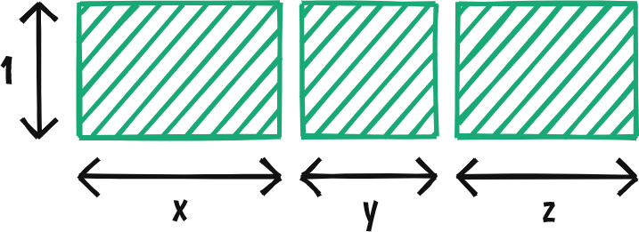

> This post was inspired by a [CSS-Tricks article](https://css-tricks.com/piecing-together-approaches-for-a-css-masonry-layout/) about different approaches for building masonry layouts. At the end, I would like to present a responsive solution which **doesn’t rely on flexbox, multi-column or grid layout, but works even in browsers without JavaScript.**

I was on my journey building a website for our student society of design, based on wireframes crafted along with my friends. For the section showcasing our illustrations, we were about to go with a full-width masonry layout of images.

](./assets/goal.jpg)

At first thought, [React Photo Gallery](https://neptunian.github.io/react-photo-gallery/) provided a simple drop-in solution, but it had several drawbacks:

- 🐌 Sluggish JavaScript-based calculations when resizing the viewport
- 📦 Pulling in an additional dependency with its own styling approach
- ⛔ Without client-side scripting, no image would show up by default

We were going to build a layout with a dynamic amount of columns based on pre-defined breakpoints:


While it’s possible to pull off breakpoint-based layout transitions with regular [media queries](https://developer.mozilla.org/en-US/docs/Web/CSS/Media_Queries/Using_media_queries), using [styled-components](https://www.styled-components.com/) with [Rebass](https://rebassjs.org/) felt more convenient and systematic.

## Creating components with design systems in mind

Defining the interface of a reusable React component is non-trivial, especially when it comes to responsiveness. [Media templates](https://www.styled-components.com/docs/advanced#media-templates) let developers declare breakpoints in an application-wide scope, but they can hardly be used for specifying responsive behavior through props. 🤷

Fortunately, Rebass provides a way to address our issue by promoting the use of _responsive props._ In addition, first-class support for design systems is realizable through _themeable props._ 🎨

## Defining the interface of a responsive masonry layout

In order to control the amount of items per row with breakpoints, the desired API of our component became the following:

```jsx
<Gallery
  itemsPerRow={[2, 3]} // Custom responsive prop
  images={[
    { src: 'https://source.unsplash.com/2ShvY8Lf6l0' },
    { src: 'https://source.unsplash.com/Dm-qxdynoEc' },
    // ...
  ]}
/>
```

The `itemsPerRow` prop allows us to show 2 images per row on smaller screens and 3 on larger displays.

## Calculating the size of a single row item

Our gallery consists of rows in which the height of images are equal:



Images should be sized in proportion to their aspect ratios. For example, the second box shown on the figure above has an aspect ratio of `y` and should have a width of `y / (x + y + z)` relative to 100% (the row’s entire width).

**The wider an image is, the more horizontal space it takes to reach the height of its (potentially narrower) neighbors.**

As we are serving static images, the aspect ratio of them is known in build time. [Gatsby](https://www.gatsbyjs.org/) makes it possible to [parse structured data from YAML files](https://www.gatsbyjs.org/packages/gatsby-transformer-yaml/) like the following:

```yml
- title: Isometric clock radio
  author: Benedek Solt Antók
  image: ./works/isometric-clock-radio.png
- title: Bee eater vector bird illustration
  author: Anna Takács
  image: ./works/bee-eater-vector-bird-illustration.jpg
# ...
```

[Querying metadata of the referenced images](https://www.gatsbyjs.org/docs/working-with-images/) is also possible, through GraphQL. As a bonus, we may also opt in to use [gatsby-image](https://www.gatsbyjs.org/packages/gatsby-image/) for serving our images in the most appropriate sizes available:

```gql
{
  allWorksYaml {
    edges {
      node {
        title
        author
        image {
          childImageSharp {
            fluid {
              aspectRatio

              # Use gatsby-image later for better user experience
              ...GatsbyImageSharpFluid
            }
          }
        }
      }
    }
  }
}
```

## Loosening constraints to build the first prototype

At first, we wanted to build a masonry component with multiple screen resolutions in mind. Considering the complexity of our task, **the first prototype should only be optimized for devices with smaller displays.** 📱

The implementation is based on our calculations outlined earlier:

```jsx
import Img from 'gatsby-image';
import { chunk, sum } from 'lodash';
import React from 'react';
import { Box } from 'rebass';

const Gallery = ({ images, itemsPerRow }) => {
  // Split images into groups of the given size
  const rows = chunk(images, itemsPerRow);

  return (
    <div>
      {rows.map(row => {
        // Sum aspect ratios of images in the given row
        const rowAspectRatioSum = sum(row.map(image => image.aspectRatio));

        return row.map(image => (
          <Box
            key={image.src}
            as={Img}
            fluid={image}
            title={image.caption}
            width={`${(image.aspectRatio / rowAspectRatioSum) * 100}%`}
            css={{ display: 'inline-block' }}
          />
        ));
      })}
    </div>
  );
};

export default Gallery;
```

_(Using Rebass is not necessary here, I used it only to make the code as similar to the next iteration as possible.)_

Our component is already capable of rendering media acquired through GraphQL. In the code below, the caption of each image is also constructed:

```jsx
<StaticQuery
  query={graphql`
    # Replace this comment with the GraphQL query above
  `}
  render={data => (
    <Gallery
      itemsPerRow={2} // This will be changed to `[2, 3]` later
      images={data.allWorksYaml.edges.map(({ node }) => ({
        ...node.image.childImageSharp.fluid,
        caption: `${node.title} – ${node.author}`,
      }))}
    />
  )}
/>
```

As a result of server-side rendering, all the calculations are made upfront. **No JavaScript was executed on the client side** to produce the layout below:


## Making our gallery responsive

At this point, the only challenge left to tackle is about handling different viewport sizes. I annotated the code below, letting it speak for itself:

```jsx
import Img from 'gatsby-image';
import { chunk, sum } from 'lodash';
import React from 'react';
import { Box } from 'rebass';

const Gallery = ({ images, itemsPerRow: itemsPerRowByBreakpoints }) => {
  const aspectRatios = images.map(image => image.aspectRatio);

  // For each breakpoint, calculate the aspect ratio sum of each row's images
  const rowAspectRatioSumsByBreakpoints = itemsPerRowByBreakpoints.map(
    itemsPerRow =>
      // Split images into groups of the given size
      chunk(aspectRatios, itemsPerRow).map(rowAspectRatios =>
        // Sum aspect ratios of images in the given row
        sum(rowAspectRatios),
      ),
  );

  return (
    <div>
      {images.map((image, i) => (
        <Box
          key={image.src}
          as={Img}
          fluid={image}
          title={image.caption}
          width={rowAspectRatioSumsByBreakpoints.map(
            // Return a value for each breakpoint
            (rowAspectRatioSums, j) => {
              // Find out which row the image is in and get its aspect ratio sum
              const rowIndex = Math.floor(i / itemsPerRowByBreakpoints[j]);
              const rowAspectRatioSum = rowAspectRatioSums[rowIndex];

              return `${(image.aspectRatio / rowAspectRatioSum) * 100}%`;
            },
          )}
          css={{ display: 'inline-block' }}
        />
      ))}
    </div>
  );
};

export default Gallery;
```

## Putting it all together

Combining the code snippets above, a responsive masonry layout of any kind can be built, as long as the aspect ratio of each item is known in advance.

_A real-world demo of the presented gallery can be found [here](https://5c3c606c7cee650008e928a6--schdesign.netlify.com/#works), along with its [source code published on GitHub](https://github.com/simonyiszk/schdesign-web/tree/1ee8aa87b702a1ef0473e8a553207c3a2355d128)._
